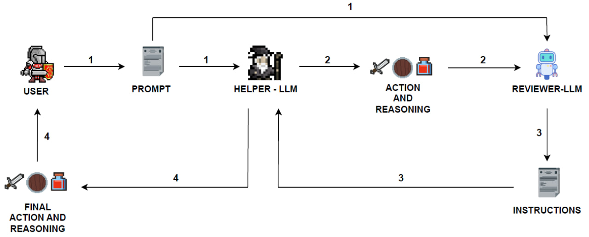

# Migliorare-un-NPC-in-un-gioco-a-turni-tramite-LLM-e-RL
I Non-Player Character (NPC), o personaggi non giocanti, sono entità presenti nei videogiochi, gestite dal sistema, che contribuiscono a rendere il mondo di gioco più immersivo e realistico, arricchendo l’esperienza complessiva del giocatore. Ad esempio, in un videogioco che presenta combattimenti a turni, la presenza di un NPC con il quale conversare per ottenere suggerimenti è un qualcosa che potrebbe rendere maggiormente interattivo lo scontro. Gli NPC sono progettati per interagire con i giocatori in molteplici modi, ricoprendo ruoli diversi. Tuttavia, sebbene siano una componente essenziale nei videogiochi, la loro implementazione può spesso risultare limitata, con comportamenti statici e dialoghi poco realistici. Questo accade perché si basano su set predefiniti di risposte che, durante lunghe sessioni di gioco, possono diventare ripetitivi e frustranti per il giocatore.
Questo progetto di tesi affronta la possibilità di usare i Large Language Models (LLM), in particolare FlanT5-Large, ed il Reinforcement Learning (RL) per creare un NPC in grado di assistere un giocatore, rappresentato da un agente, suggerendo la prossima azione da intraprendere. Uno dei principali limiti degli LLM è la tendenza a generare allucinazioni, ovvero risposte sintatticamente corrette ma disconnesse dalla realtà. Per alleviare il problema delle allucinazioni, è stato chiesto al NPC di fornire il suo reasoning e, grazie ad un ulteriore agente di LLM addestrato tramite Proximal Policy Optimization (PPO), sono stati forniti istruzioni per effettuare il rephrasing della risposta iniziale, con l’obiettivo di rendere i consigli più efficaci possibili. Per testare l’efficacia dell’approccio proposto sono stati condotti esperimenti su un numero variabile di episodi. Inoltre, è stato condotto un test con una configurazione in due fasi in cui, nella prima, l’agente opera in autonomia per un determinato numero di episodi, mentre nella seconda è supportato dalla metodologia proposta, al fine di analizzare l’impatto dei consigli sulla strategia finale. I risultati dimostrano un significativo incremento nella qualità delle azioni proposte, evidenziando il potenziale dell’integrazione tra LLM e RL per migliorare l’interazione con un NPC nei videogiochi.

## Architettura
Per valutare l’efficacia di un NPC nel fornire suggerimenti sulla prossima azione da intraprendere, è stato sviluppato un environment ispirato alle battaglie a turni dei primi videogiochi di Final Fantasy. La battaglia vede protagonisti un utente, rappresentato da un
agente, ed un nemico. L’NPC, denominato Helper, offre a ogni turno consigli all’agente. L’obiettivo è sconfiggere il nemico nel modo più efficace possibile, seguendo i suggerimenti forniti da Helper.
L’architettura proposta comprende tre moduli principali:
- **User**: rappresenta l’utente all’interno dell’environment.
- **Helper-LLM**: rappresenta il LLM incaricato di fornire consigli su quali azioni intraprendere.
- **Reviewer-LLM**: è un modello basato su LLM che fornisce istruzioni per migliorare il reasoning del modulo Helper-LLM.

Le fasi che regolano l’interazione tra questi moduli sono le seguenti:
1. **Generazione del prompt**:  
   Ad ogni turno di gioco, il modulo User genera un prompt contenente informazioni dettagliate sullo stato dell’environment, inclusa l’ultima azione effettuata dal nemico. Questo prompt viene inviato al modulo Helper-LLM ed al modulo Reviewer-LLM.
2. **Risposta iniziale del modulo Helper-LLM**:  
   Il modulo Helper-LLM elabora una risposta iniziale sulla base del prompt ricevuto. Questa risposta, composta dall’azione consigliata e dal reasoning, viene inoltrata, insieme al prompt iniziale, al modulo Reviewer-LLM.
3. **Analisi e feedback del modulo Reviewer-LLM**:  
   Il modulo Reviewer-LLM analizza il prompt e la risposta iniziale del modulo Helper-LLM ed individua eventuali punti non considerati all’interno del reasoning. Sulla base di questa analisi elabora delle istruzioni che vengono restituite al modulo Helper-LLM.
4. **Riformulazione della risposta**:  
   Il modulo Helper-LLM, sulla base delle istruzioni ricevute dal modulo Reviewer-LLM, riformula la risposta iniziale per ottimizzare il reasoning e migliorare la coerenza del suggerimento. La risposta ed il reasoning aggiornati vengono infine forniti al modulo User.
